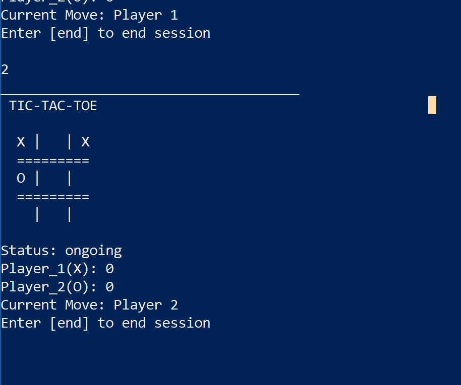
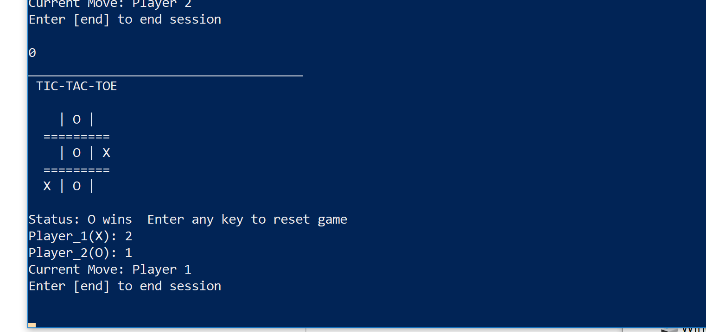
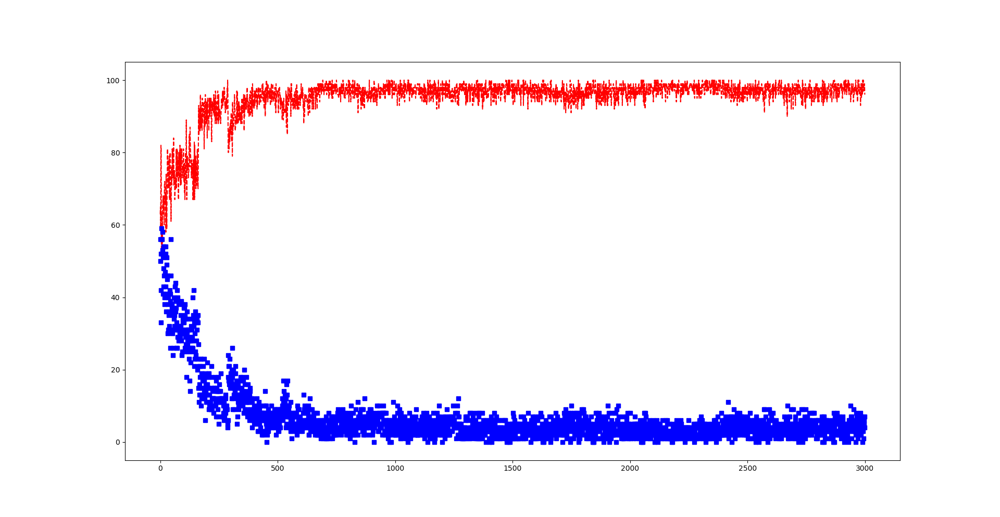

# Tic_Tac_Toe_ML
Create a TicTacToe Game and AI using machine learning

### Overview

The fact that machine learning is able master complicated games like chess is just really amazing, and I wanted to learn how to do that.  For the purpose of learning machine learning, I created a Tic Tac Toe environment to play the game, implemented a Q Learning Reinforcement Model, and trained the Model on my game!

### Play the AI
To Play against the trained Model, run the file 'Versus_Model.py' in the terminal. To make a move, press keys 0 - 8, each representing a index in the TicTacToe board, as shown below. The file "Saved_Models/Q_table_new_for_show.pkl" stores the trained Q table. 'Versus_Model.py' will automatically load this file.

Move Mapping

0 | 1 | 2 

3 | 4 | 5

6 | 7 | 8

The game will look like this

<table width="500" border="0" cellpadding="5">

<tr>

<td align="center" valign="center">

 
Game Ongoing
</td>

<td align="center" valign="center">

 
Game Ended
</td>

</tr>

</table>

### Game Environment
Creating, Managing, Logging, Playing and Visualizing Games of Tic Tac Toe
The code is found in TicTac.py

I implemented a class for my Tic Tac Toe Game that stored the important information about the game such as
* The Game State
* The Score
* The Game History
* Which Player's Turn to Move 
* The Board

These functions and methods to allow easy interfacing with the game
* step( )
* str( )
* reset( )
* is_win( ) 
* check_end_game( )

Player Classes to Represent Player Entities and stores values such as
* Symbol
* Scores

## Reinforcement Learning
The code is found in TTT_Q_learning.py
In order to create an AI I used a type of machine learning model called Q learning, which is based off of the Markov Decision Process. The Model was trained with both an AI that moved in random places and an online Tic Tac Toe API.

### My Q Learning Model
Q learning is a type of reinforcement machine learning model that learns from the rewards of their past actions. Different board postition combinations are represented as states. So every different X, O,  and 'empty space' combinations is a different state. Given a state, a player can make a move and place a X or O in one of the 'empty spaces'. This transition of current state to new state is an action. The Q table stores every state-action pair and a number associated with it. This number is called the Q value. High Q value means that state-action pair associated with the value is good for the player and may lead to a higher chance of victory than a lower value. 
My Q table is represented as a the Q_Model( ) class. This class manages creating Q tables, updating Q values, making moves, and running trainings.

#### Updating the Q Table
After each round of tic tac toe, the player either wins, loses, or ties, and each of these outcomes has a rewards associated with it. 
Ties and wins have positive rewards while loses have negative rewards. During the learning process, the model follows its past actions through the Q table and updates the Q values using the Bellman Equation 

#### Using The Q Table
During game play, the AI does something called a MiniMax search through the Q table to determine its next move. The MiniMax search is also used by advanced Chess AI's to look multiple steps into the future in order to find a good move. The MiniMax search looks at the possible steps the player can currently take and also the possible steps the opponent can take following the player's move. The player wants moves that maximizes the Q value, while the opponent will try to make moves to minimize the Q values. Assuming the opponent will try to minimize the Q value, the MiniMax Search will choose the move that will lead to the largest of those minimums.

The function Model_Step( ) first looks for any move that will automatically lead to victory. If those don't exist, it will use a MiniMax search using the Q Table and the current board position to choose the best move.

#### Results
The model was initially trained with a AI that made random moves. The model quickly learned how to beat the AI, but this wasn't enough to beat any human player. I could still easily beat my Model. Its seems like it just learned an easy way to defeat the Random AI, but isn't able to generalize to any player. To address this, I ran my training with a TicTacToe API and I factored in different levels of randomness into the API, or else the Model would never win. 

##### Random vs Model
* Red = Model
* Blue = Random
* Y axis: Wins per batch
* X axis: Batch Number

#### API vs Model
In order to train the Model with a more advanced opponent I used a online TicTacToe API to train the model. The API use can be found in API_TTT.py. After running multiple trainings(and fixing bugs), this was the result. 

It is a bit hard to see on this graph, but there is a green line that graphs the overall average score of the Model over the course of training. The yellow line is the overall score of the API. The Model starts of doing worse than the API, but then the score startes to approach that of the API. The Blue and Red lines are the scores for each training batch and the line near the bottom shows the number of ties in the game.
