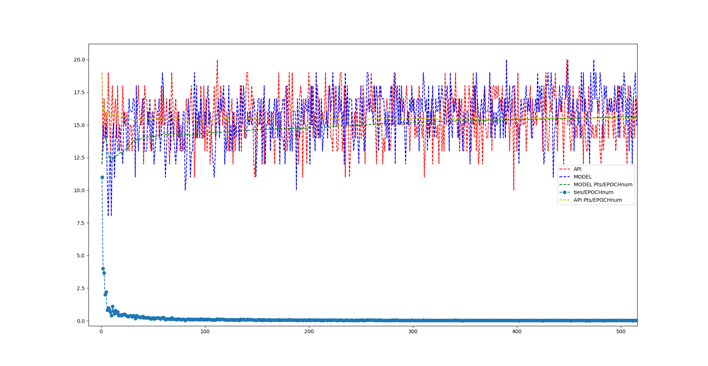

# Tic_Tac_Toe_ML
Create a TicTacToe Game and AI using machine learning

### Overview

The fact that machine learning is able master complicated games like chess is just really amazing, and I wanted to learn how to do that.  For the purpose of learning machine learning, I created a Tic Tac Toe environment to play the game, implemented a Q Learning Reinforcement Model, and trained the Model on my game!

### Game Class

I implemented a class for my Tic Tac Toe Game that stored the important information about the game such as
* The Game State: ongoing, tie, player 1 wins or player 2 wins
* The Score
* The Board: A tuple with each index representing one of the 9 indexs of a game board, with values:
..* 0: empty
..* 1: Player 1
..* 2: Player 2
* The Game History
* Which Player's Turn to Move 
This class also has fucntions to allow easy interfacing with the game
* 

